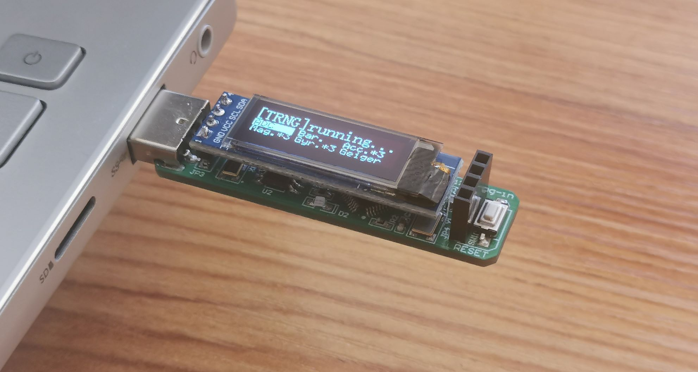
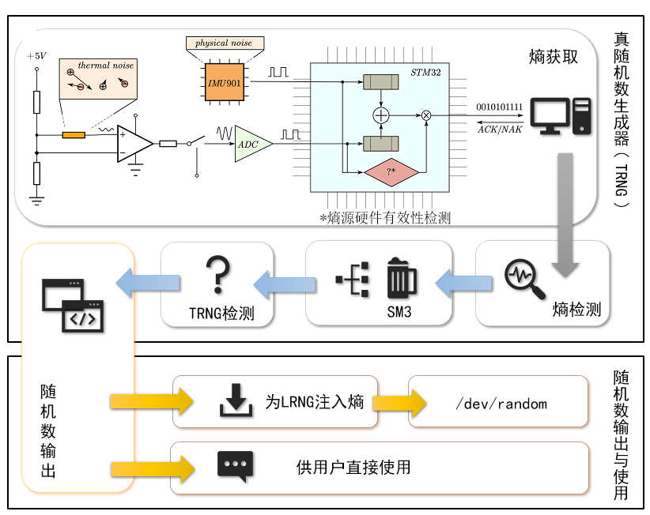
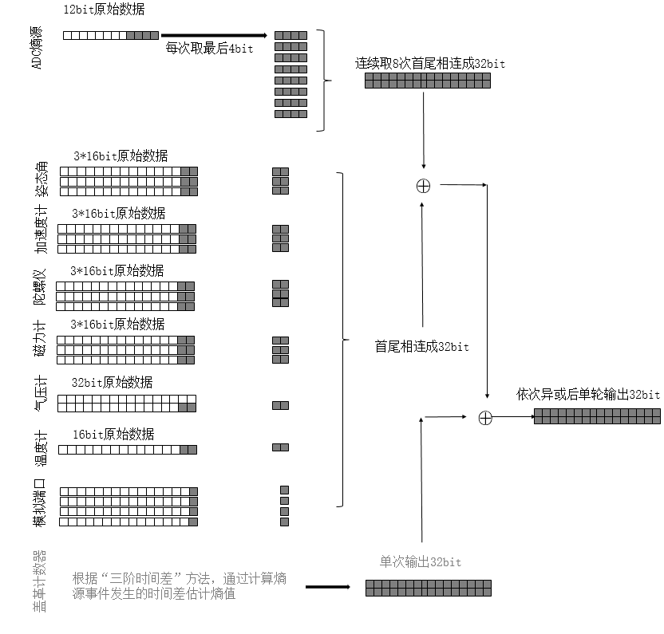
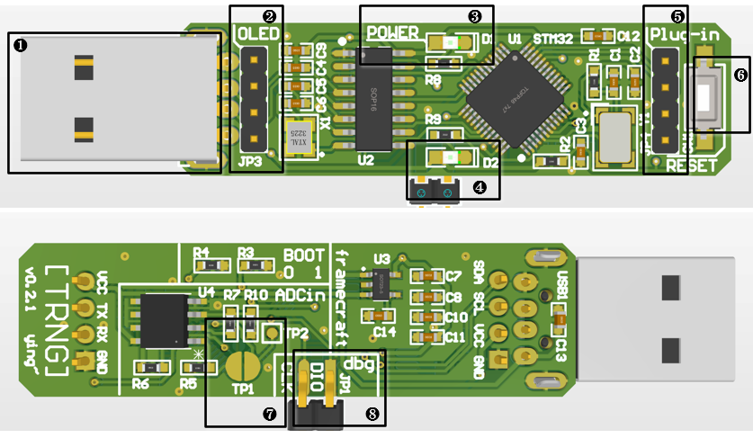

# 基于SM3的多熵源真随机数发生器 

## 下位机

① USB口连接电脑

② 0.91寸OLED显示屏接口

③ 电源指示灯

④ 工作指示灯

⑤ 支持更多可选外设的拓展口，支持十轴传感器等

⑥ 重置按钮

⑦ 可选的外部噪声ADC输入口

⑧ 调试端口

建议 VSCode 插件 [Keil Assistant - Visual Studio Marketplace](https://marketplace.visualstudio.com/items?itemName=CL.keil-assistant)

| 下位机OLED信息    | 说明                                   |
| ----------------- | -------------------------------------- |
| `:( msg time out` | 等待上位机消息超时                     |
| `:(   NAK ERROR ` | NAK错误                                |
| `[TRNG]host stop` | 上位机主动终止程序                     |
| `:(   PKC ERROR ` | 认证错误                               |
| `:(   TRNG ERROR` | 真随机数错误（如上位机判断熵不再随机） |
| `:(    PC ERROR ` | 上位机程序错误                         |
| `:(  udef ERROR ` | 未定义错误（常见于串口传输出错）       |

## 上位机

---
Framecraft

